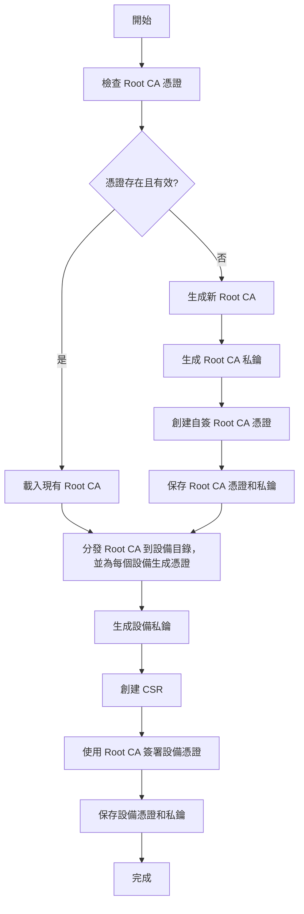

# IoT CA 憑證管理系統 (ca-iot-sys-ttt)

一個基於 Docker 的 IoT 系統，實現了完整的 CA 憑證管理、MQTT 安全通訊和 Web dashboard監控。

## 專案結構

```
ca-iot-sys-ttt/
├── README.md                          # 專案說明文件
├── requirements.txt                   # Python 依賴清單
├── setup.sh                           # 一鍵部署腳本
├── docker-compose.yml                 # Docker Compose
├── generate_ca_and_device_certs.py    # CA 和設備憑證生成腳本
├── thermometer.py                     # 溫度計設備模擬程式
├── Dockerfile_thermometer             # 溫度計設備 Docker
├── certs/                             # 憑證目錄
│   ├── root_ca/                       # Root CA 憑證
│   ├── device001/                     # 設備001憑證
│   ├── device002/                     # 設備002憑證
│   ├── mosquitto/                     # MQTT Broker 憑證與 mosquitto.conf
│   └── dashboard/                     # dashboard憑證
└── dashboard/                         # Web dashboard
    ├── app.py                         # Flask 應用程式
    ├── requirements.txt               # dashboard依賴清單
    ├── Dockerfile                     # dashboard Docker
    ├── dashboard_certs/               # dashboard憑證目錄
    └── templates/                     # HTML 模板
```

## 系統架構

```
┌─────────────────────┐    ┌─────────────────────┐    ┌─────────────────────┐
│    IoT 設備         │    │   MQTT Broker       │    │   Web dashboard        │
│  (Thermometer)      │    │   (Mosquitto)       │    │   (Dashboard)       │
│                     │    │                     │    │                     │
│  ┌─────────────┐    │    │  ┌─────────────┐    │    │  ┌─────────────┐    │
│  │設備憑證     │◄───┼────┤  │伺服器憑證   │    │    │  │客戶端憑證   │    │
│  │device.crt   │    │    │  │mosquitto.crt│    │    │  │dashboard.crt│    │
│  │device.key   │    │    │  │mosquitto.key│    │    │  │dashboard.key│    │
│  └─────────────┘    │    │  └─────────────┘    │    │  └─────────────┘    │
└─────────────────────┘    └─────────────────────┘    └─────────────────────┘
          │                          │                          │
          │                          │                          │
          └──────────────────────────┼──────────────────────────┘
                                     │
                          ┌─────────────────────┐
                          │     Root CA         │
                          │                     │
                          │  ┌─────────────┐    │
                          │  │root_ca.crt  │    │
                          │  │root_ca.key  │    │
                          │  └─────────────┘    │
                          └─────────────────────┘
```

## 主要功能

### 🔐 憑證管理

- **自動化 CA 憑證生成**：自動創建 Root CA 和設備憑證
- **憑證生命週期管理**：自動檢查憑證有效期，支持自動更新
- **多設備支持**：為多個 IoT 設備生成獨立憑證
- **憑證分發**：自動將 CA 憑證分發到各設備目錄

### 🌐 安全通訊

- **TLS/SSL 加密**：所有 MQTT 通訊使用 TLS 1.2+ 加密
- **雙向認證**：客戶端和伺服器互相驗證憑證 `require_certificate true`
- **SAN 支持**：支持多域名和 IP 地址驗證

### 📊 監控dashboard

- **即時數據顯示**：即時顯示設備溫度數據
- **憑證狀態監控**：監控所有憑證的有效期和狀態
- **日誌記錄**：記錄和顯示 MQTT 通訊日誌

## 快速開始

### 環境要求

- MAC 或 Linux（windows WSL）
- Python 3.11+ （請勿使用 MAC 或 Linux 系統內建的 Python）
- Docker 和 Docker Compose

### 一鍵部署

```bash
# 執行設置腳本
./setup.sh
```

### 手動部署

```bash
# 1. 創建虛擬環境
python3 -m venv .venv
source .venv/bin/activate

# 2. 安裝依賴
pip install -r requirements.txt

# 3. 生成憑證
python3 generate_ca_and_device_certs.py

# 4. 啟動服務
docker-compose up --build
```

### 訪問服務

- **Web Dashboard**: http://localhost:5000

## CA 驗證與加密通訊流程

### 1. 憑證生成流程



### 2. 憑證驗證詳細流程

#### 2.1 憑證鏈驗證

```
設備憑證 → Root CA 憑證 `client.tls_set`
↓
1. 檢查憑證簽名（使用 Root CA 公鑰）
2. 驗證憑證有效期
3. 驗證主體名稱和 SAN
```

#### 2.2 雙向認證流程

```
伺服器認證流程：
1. Broker 出示伺服器憑證
2. 設備使用 Root CA 憑證驗證伺服器憑證
3. 驗證伺服器身份

客戶端認證流程：
1. 設備出示設備憑證
2. Broker 使用 Root CA 憑證驗證設備憑證
3. 驗證設備身份
```


